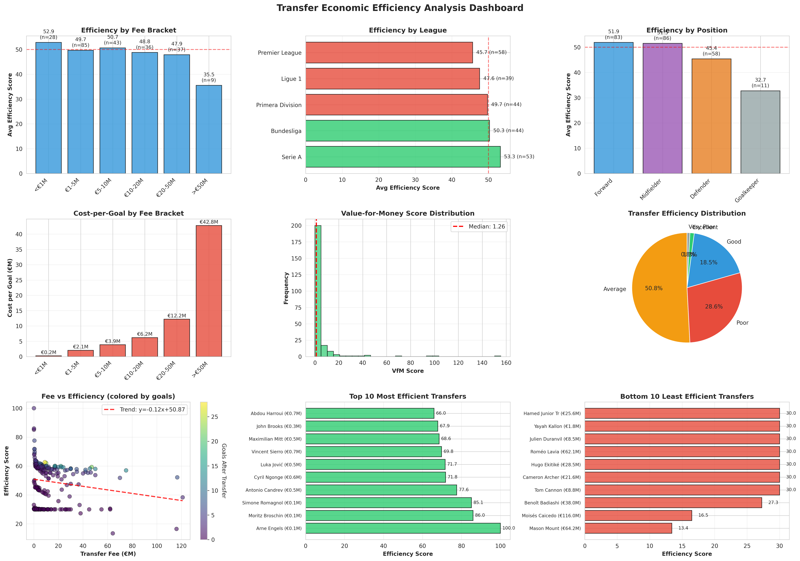
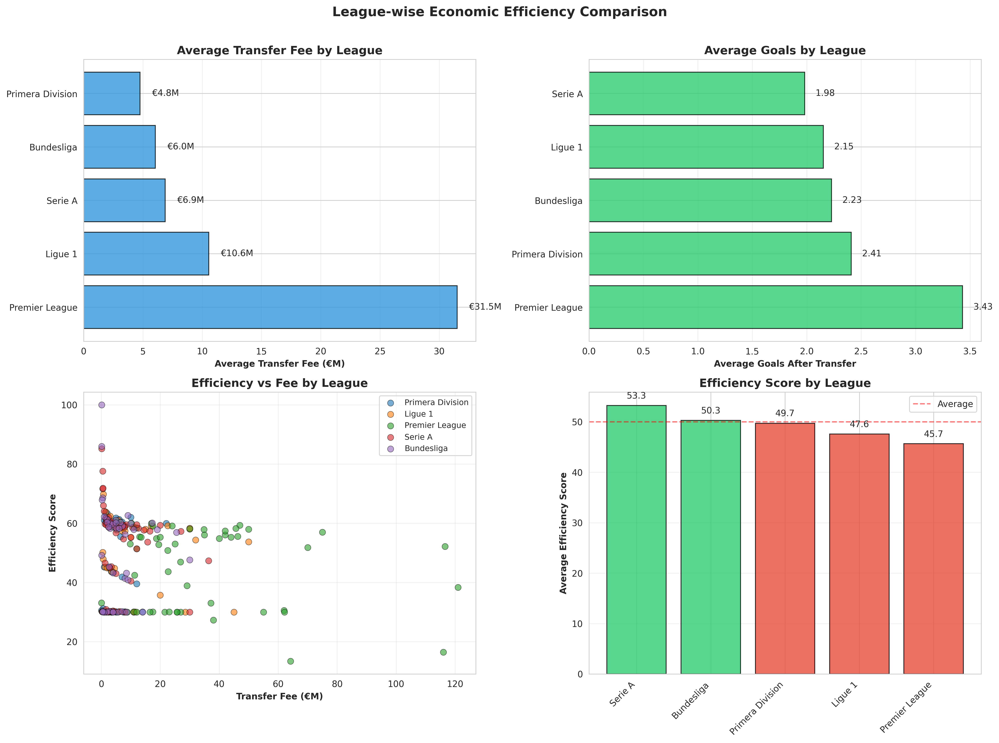

# Transfer Economic Efficiency Analysis

[](https://opensource.org/licenses/MIT)
[](https://www.python.org/downloads/)
[]()

## 📋 Project Overview

This project analyzes the economic efficiency of football transfers by measuring the relationship between transfer fees and player performance contributions. Using 238 paid transfers from Europe's Top 5 leagues (2020-2023), we calculate comprehensive efficiency metrics to identify value-for-money patterns and optimal spending strategies.

**Key Question:** *Are football clubs getting value for money in their transfer investments?*

---

##  Key Findings

### Overall Efficiency

- **Only 19.8%** of transfers achieve "Good" or "Excellent" efficiency
- **29.4%** are classified as "Poor" or "Very Poor"
- **Average efficiency score:** 49.28/100
- **Average cost-per-goal:** €5.63M

### Fee Bracket Analysis

| Fee Bracket | Avg Efficiency | Cost/Goal | Key Insight |
|-------------|---------------|-----------|-------------|
| **<€1M** | **52.85**  | €0.20M | **Most efficient** - low-cost signings deliver best value |
| €1-5M | 49.66 | €2.14M | Good balance of cost and performance |
| €5-10M | 50.66 | €3.98M | **Optimal sweet spot** - highest avg goals (3.12) |
| €10-20M | 48.83 | €6.24M | Below-average efficiency |
| €20-50M | 47.89 | €12.24M | Poor value relative to cost |
| **>€50M** | **35.52**  | €42.76M | **Least efficient** - 27% below average |

### League Comparison

| League | Avg Efficiency | Avg Fee | Avg Goals | Insight |
|--------|---------------|---------|-----------|---------|
| **Serie A** | **53.26**  | €6.9M | 1.98 | **Most efficient league** |
| Bundesliga | 50.31 | €6.1M | 2.23 | Strong value and development |
| La Liga | 49.73 | €4.8M | 2.41 | Moderate fees, good output |
| Ligue 1 | 47.59 | €10.6M | 2.15 | Underperforms relative to spending |
| **Premier League** | **45.67**  | **€31.5M** | 3.43 | **Least efficient** - fee inflation |

### Position Analysis

| Position | Avg Efficiency | Avg Fee | Avg Goals |
|----------|---------------|---------|-----------|
| **Forward** | **51.90**  | €15.2M | 4.22 |
| Midfielder | 51.52 | €15.7M | 2.34 |
| Defender | 45.36 | €7.1M | 0.71 |
| Goalkeeper | 32.75 | €5.6M | 0.00 |

*Note: Metrics are biased toward attacking positions (goals/assists). Defensive analysis requires separate metrics.*

---

##  Visualizations

### Efficiency Dashboard


**9-panel comprehensive dashboard showing:**
- Efficiency by fee bracket, league, and position
- Cost-per-goal analysis
- VfM score distribution
- Top 10 most/least efficient transfers
- Fee vs efficiency scatter plot

### League Comparison


**League-wise analysis including:**
- Average transfer fees by league
- Average goals by league
- Efficiency vs fee scatter (by league)
- Efficiency score comparison

---

##  Strategic Recommendations

### For Football Clubs

1. **Target the €5-10M fee bracket**
   - Best balance of quality and efficiency
   - Highest average goals (3.12)
   - Above-average efficiency (50.66)

2. **Scout Serie A and Bundesliga**
   - Highest efficiency leagues (53.26 and 50.31)
   - Lower fee inflation than Premier League
   - Strong player development systems

3. **Leverage free/low-cost transfers**
   - Most efficient category (<€1M: 52.85 efficiency)
   - Target experienced players (27-30 years)
   - Low financial risk with high upside

4. **Avoid >€50M transfers unless essential**
   - Lowest efficiency (35.52)
   - High cost-per-goal (€42.76M)
   - Only justified for proven world-class talent

5. **Prioritize forwards and midfielders**
   - Highest efficiency scores (51.90 and 51.52)
   - Measurable attacking contributions
   - Justify investment through goals/assists

### Key Correlation Insights

- **Transfer fee ↔ Efficiency:** -0.160 (negative) ⚠
- **Goals ↔ Efficiency:** +0.476 (strong positive) 
- **Assists ↔ Efficiency:** +0.450 (strong positive) 
- **VfM Score ↔ Efficiency:** +0.496 (strong positive) 

**Implication:** Performance drives efficiency, not price. Data-driven scouting can identify undervalued players.

---

## 🔬 Methodology

### Efficiency Metrics

#### 1. Value-for-Money (VfM) Score
```
VfM = Performance Index (0-100) / Transfer Fee (€M)
```
Performance per million euros spent.

#### 2. Cost-per-Goal
```
Cost-per-Goal = Transfer Fee (€M) / Goals After Transfer
```
Investment required per goal scored.

#### 3. Cost-per-Contribution
```
Cost-per-Contribution = Transfer Fee (€M) / (Goals + Assists)
```
Investment required per goal contribution.

#### 4. Composite Efficiency Score
```
Efficiency = 0.4 × VfM + 0.3 × CPG⁻¹ + 0.3 × CPC⁻¹
```
Weighted composite metric (0-100 scale).

### Performance Index Components

- **Goals After Transfer** (weighted 10×)
- **Assists After Transfer** (weighted 5×)
- **Minutes Played** (weighted 0.5×)

All metrics normalized to 0-100 scale for comparability.

### Efficiency Categories

| Category | Score Range | Description |
|----------|-------------|-------------|
| **Excellent** | 80-100 | Exceptional value |
| **Good** | 60-79 | Above-average value |
| **Average** | 40-59 | Market-standard value |
| **Poor** | 20-39 | Below-average value |
| **Very Poor** | 0-19 | Significant overpayment |

---

##  Project Structure

```
transfer-economic-efficiency/
├── data/
│   ├── raw/
│   │   └── transfers_with_performance.csv    # 1,483 transfer records
│   └── processed/
│       └── transfer_efficiency_metrics.csv   # 238 paid transfers with metrics
├── src/
│   ├── efficiency/
│   │   └── calculate_efficiency_metrics.py   # Efficiency calculation
│   ├── analysis/
│   │   └── comprehensive_efficiency_analysis.py  # Statistical analysis
│   └── visualization/
│       └── create_efficiency_visualizations.py   # Chart generation
├── results/
│   ├── figures/
│   │   ├── efficiency_dashboard.png          # 9-panel dashboard
│   │   └── league_efficiency_comparison.png  # League analysis
│   ├── ECONOMIC_EFFICIENCY_REPORT.md         # Comprehensive 20-page report
│   ├── efficiency_by_fee_bracket.csv
│   ├── efficiency_by_league.csv
│   ├── efficiency_by_position.csv
│   └── efficiency_summary.json
├── README.md
└── requirements.txt
```

---

##  Getting Started

### Prerequisites

```bash
python >= 3.11
```

### Installation

```bash
git clone https://github.com/mehmetyalc/transfer-economic-efficiency.git
cd transfer-economic-efficiency
pip install -r requirements.txt
```

### Usage

#### 1. Calculate Efficiency Metrics
```bash
python src/efficiency/calculate_efficiency_metrics.py
```
Generates `transfer_efficiency_metrics.csv` with VfM, cost-per-goal, and efficiency scores.

#### 2. Run Comprehensive Analysis
```bash
python src/analysis/comprehensive_efficiency_analysis.py
```
Analyzes efficiency by fee bracket, league, position, and age group.

#### 3. Generate Visualizations
```bash
python src/visualization/create_efficiency_visualizations.py
```
Creates comprehensive dashboard and league comparison charts.

#### 4. View Results
```bash
# Read comprehensive report
cat results/ECONOMIC_EFFICIENCY_REPORT.md

# View visualizations
open results/figures/efficiency_dashboard.png
open results/figures/league_efficiency_comparison.png

# Explore analysis CSVs
cat results/efficiency_by_fee_bracket.csv
cat results/efficiency_by_league.csv
```

---

##  Top 10 Most Efficient Transfers

| Rank | Player | Fee | Goals | Assists | Efficiency | Category |
|------|--------|-----|-------|---------|------------|----------|
| 1 | Arne Engels | €0.1M | 3 | 2 | 100.00 | Excellent |
| 2 | Moritz Broschinski | €0.1M | 2 | 3 | 85.97 | Excellent |
| 3 | Simone Romagnoli | €0.1M | 1 | 1 | 85.14 | Excellent |
| 4 | Antonio Candreva | €0.5M | 6 | 6 | 77.60 | Good |
| 5 | Cyril Ngonge | €0.6M | 6 | 2 | 71.82 | Good |
| 6 | Luka Jović | €0.5M | 6 | 1 | 71.66 | Good |
| 7 | Vincent Sierro | €0.7M | 6 | 2 | 69.82 | Good |
| 8 | Maximilian Mittelstädt | €0.5M | 2 | 4 | 68.56 | Good |
| 9 | John Brooks | €0.3M | 2 | 0 | 67.87 | Good |
| 10 | Abdou Harroui | €0.7M | 3 | 3 | 65.96 | Good |

**Common traits:** Low fees (<€1M), experienced players, immediate impact, high goal contributions.

---

##  Dataset Information

### Data Sources

- **Transfer Fees:** Transfermarkt, FBref
- **Performance Data:** FBref (goals, assists, minutes)
- **Leagues:** Premier League, La Liga, Serie A, Bundesliga, Ligue 1
- **Time Period:** 2020-2023 seasons
- **Total Transfers:** 1,483 (all transfers)
- **Paid Transfers:** 238 (analyzed for efficiency)

### Data Quality

-  Validated transfer fees from multiple sources
-  Complete performance data (goals, assists, minutes)
-  League and position classifications
-  Consistent data format and structure

---

## 🔧 Technical Stack

- **Programming Language:** Python 3.11+
- **Data Processing:** Pandas 2.2.3, NumPy 2.0.2
- **Statistical Analysis:** SciPy, Statsmodels
- **Visualization:** Matplotlib 3.9.2, Seaborn 0.13.2
- **Development:** Jupyter Notebooks, Git

---

## 📚 Documentation

### Reports

- **[ECONOMIC_EFFICIENCY_REPORT.md](results/ECONOMIC_EFFICIENCY_REPORT.md)** - Comprehensive 20-page analysis report
  - Executive summary
  - Detailed methodology
  - Fee bracket, league, and position analysis
  - Top/bottom performers
  - Strategic recommendations
  - Limitations and future directions

### Analysis Files

- `efficiency_by_fee_bracket.csv` - Efficiency metrics by fee range
- `efficiency_by_league.csv` - League-wise efficiency comparison
- `efficiency_by_position.csv` - Position-wise efficiency analysis
- `efficiency_summary.json` - Overall summary statistics

---

## 💼 Use Cases

### For Football Clubs

- **Transfer Strategy:** Identify market inefficiencies and value opportunities
- **Budget Allocation:** Optimize spending across positions and fee brackets
- **Negotiation:** Data-backed valuation for transfer targets
- **Risk Management:** Assess transfer success probability

### For Analysts & Researchers

- **Market Analysis:** Study transfer market trends and efficiency
- **Comparative Studies:** Cross-league and cross-position efficiency
- **Academic Research:** Empirical evidence for football economics
- **Predictive Modeling:** Build transfer success forecasting models

### For Fans & Media

- **Transfer Evaluation:** Assess club's transfer business objectively
- **Player Valuation:** Understand fair market prices
- **Performance Analysis:** Compare player contributions to cost

---

##  Limitations

### Current Limitations

1. **Attacking bias:** Metrics favor forwards/midfielders (goals/assists)
2. **Short-term window:** 1-3 seasons post-transfer
3. **Missing financial data:** Salaries, agent fees, bonuses not included
4. **No resale value:** Market value appreciation not tracked
5. **Sample size:** 238 paid transfers (some categories have small n)

### Enhancements

1. **Expand to defensive metrics**
   - Tackles, interceptions, clean sheets
   - Position-specific performance indices
   - Comprehensive defender/goalkeeper analysis

2. **Include total cost of ownership**
   - Salary and wage data
   - Agent fees and bonuses
   - Amortization and accounting impact

3. **Track market value changes**
   - Player value appreciation/depreciation
   - ROI calculation including resale
   - Capital gains analysis

4. **Build predictive models**
   - Machine learning for transfer success forecasting
   - Feature importance for efficiency drivers
   - Transfer valuation tool


##  Theoretical Background

This project draws on:

- **Sports Economics:** Transfer market efficiency theory
- **Operations Research:** Data Envelopment Analysis (DEA) methodology
- **Performance Analytics:** Player valuation models
- **Financial Analysis:** ROI and cost-benefit analysis

### Key References

- Farrell, M.J. (1957). "The Measurement of Productive Efficiency"
- Charnes, A., Cooper, W.W., & Rhodes, E. (1978). "Measuring the efficiency of decision making units"
- Carmichael, F., & Thomas, D. (2005). "Production and efficiency in team sports"

